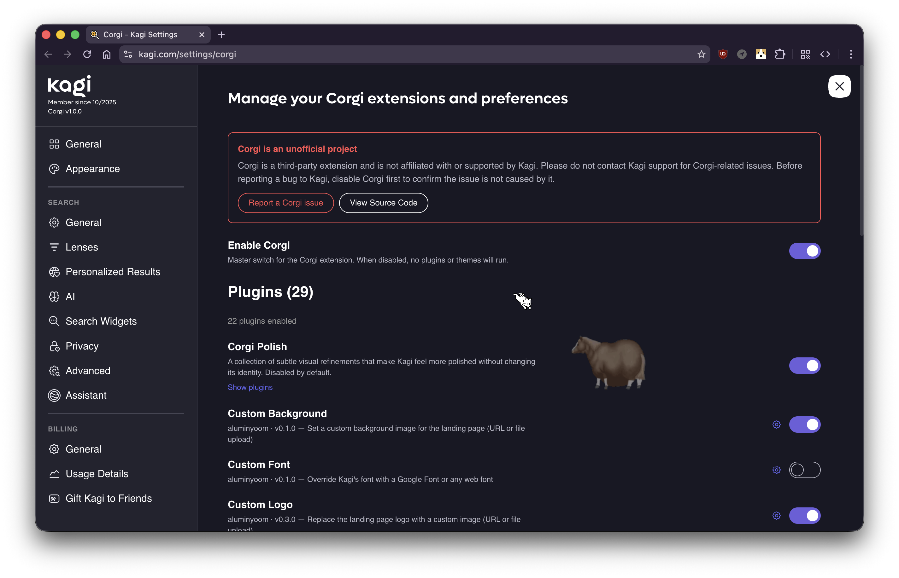

<p align="center">
  
</p>

<h1 align="center">Corgi</h1>

<p align="center">A plugin system and theming engine for <a href="https://kagi.com">Kagi Search</a>.</p>

> [!WARNING]
> **Corgi is in heavy development.** Things will break, APIs will change, and dragons roam freely. If you hit a bug, please [open an issue](https://github.com/aluminyoom/corgi/issues).



Corgi hooks into Kagi's page, patches its runtime, and gives you a plugin API to extend everything. Settings live inside Kagi's own settings page at `/settings/corgi`, so the whole experience feels native.

It ships with **29 built-in plugins** across three categories: 12 visual polish, 4 customization, and 13 utilities. See the [full plugin list](https://corgi.ryanaque.com/guide/using-plugins) in the docs.

## Build Requirements

- **OS**: macOS, Linux, or Windows
- **Node.js**: v20 or later — [install](https://nodejs.org/)
- **pnpm**: v9.15.4 — install with `corepack enable && corepack prepare pnpm@9.15.4 --activate`, or `npm install -g pnpm@9.15.4`

## Build from Source

### Firefox

```bash
git clone https://github.com/aluminyoom/corgi.git
cd corgi
pnpm install
pnpm --filter @corgi/extension build:firefox
```

The built extension is in `extension/.output/firefox-mv2/`.

To produce a zip for upload to addons.mozilla.org:

```bash
pnpm --filter @corgi/extension zip:firefox
```

Output: `extension/.output/corgiextension-1.0.1-firefox.zip`

### Chrome

```bash
git clone https://github.com/aluminyoom/corgi.git
cd corgi
pnpm install
pnpm --filter @corgi/extension build
```

Then load `extension/.output/chrome-mv3` as an unpacked extension in `chrome://extensions` with Developer Mode enabled.

### Build Tools

This extension uses the following tools that process source code into the final output:

- **[WXT](https://wxt.dev/)** v0.20 — browser extension framework (build orchestration)
- **[Vite](https://vitejs.dev/)** v7 — bundler (combines and minifies modules)
- **[Svelte](https://svelte.dev/)** v5 — UI compiler (compiles `.svelte` components to JS)
- **[TypeScript](https://www.typescriptlang.org/)** v5.7 — transpiles `.ts` to JS

All dependencies and their exact versions are pinned in `pnpm-lock.yaml`.

## Development

```bash
cd extension
pnpm dev             # hot reload (Chrome)
pnpm dev:firefox     # hot reload (Firefox)
pnpm build           # production (Chrome)
pnpm build:firefox   # production (Firefox)
pnpm zip             # package for Chrome distribution
pnpm zip:firefox     # package for Firefox distribution
```

To create a plugin, drop a `.ts` file in `extension/src/plugins/builtins/` and auto-discovery handles the rest:

```ts
import { definePlugin } from "@/plugins/api";

export const myPlugin = definePlugin({
  name: "my-plugin",
  displayName: "My Plugin",
  version: "0.1.0",
  authors: ["your-name"],
  description: "Does something cool",
  onStart(api) {
    // Your code here
  },
});
```

See [Creating Plugins](https://corgi.ryanaque.com/guide/creating-plugins) for the full API reference.

## Docs

VitePress docs live in `docs/` and can be run locally:

```bash
cd docs && pnpm install && pnpm dev
```

## License

[MIT](LICENSE). Made by [aluminyoom](https://github.com/aluminyoom).

_Not affiliated with Kagi Inc. Do not contact Kagi support for Corgi issues._
